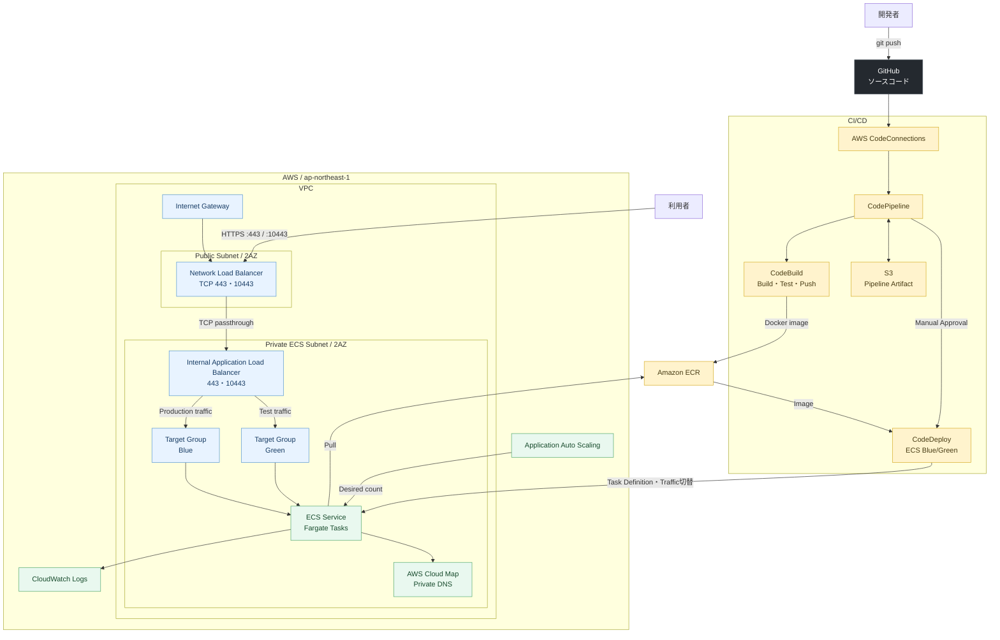

# Terraform AWS API Platform

Terraformで構築する、AWS上のコンテナアプリケーション基盤です。

GitHubへのpushを起点にDockerイメージをビルドしてECRへ保存し、
CodeDeployによるBlue/Green方式でECS Fargateへデプロイします。

## デプロイフロー

```text
GitHub
  ↓
CodePipeline
  ↓
CodeBuild（Dockerイメージのビルド・テスト）
  ↓
Amazon ECR
  ↓
CodeDeploy（Blue/Greenデプロイ）
  ↓
Amazon ECS Fargate
```

## システム設計図



通信経路は `Internet → NLB → Internal ALB → ECS` に限定しています。
CodeDeployは2つのTarget Groupを使い、新しいタスクをテスト用ポートで確認してから
本番トラフィックを切り替えます。

## 主なAWSサービス

- VPC、Subnet、Security Group
- Network Load Balancer
- Application Load Balancer
- Amazon ECS Fargate
- Amazon ECR
- Amazon CloudWatch Logs
- AWS CodeConnections
- AWS CodePipeline
- AWS CodeBuild
- AWS CodeDeploy
- Application Auto Scaling

## ディレクトリ構成

```text
.
├── app/                         # 猫の紹介サイト
├── common/prd_test2/            # PRD環境のルートモジュール
├── modules/
│   ├── network/                 # Subnet、Route Table、Internet Gateway
│   ├── security_groups/         # NLB、ALB、ECSの通信制御
│   ├── load_balancing/          # NLB、ALB、Listener、Target Group
│   ├── ecs/                     # Cluster、Service、Task Definition、Cloud Map
│   ├── autoscaling/             # ECS Auto ScalingとCloudWatch Alarm
│   ├── ecr/                     # ECR RepositoryとLifecycle Policy
│   └── cicd/                    # GitHub、CodeBuild、CodeDeploy、CodePipeline
├── Dockerfile
├── buildspec.yml
├── appspec.yaml
└── taskdef.json
```

## テストアプリケーション

`app/` には、Momoという猫を紹介するレスポンシブ対応の静的サイトが
含まれています。Nginxコンテナで配信し、`/health` をヘルスチェックに使用します。

ローカルでプレビューする場合は、PowerShellで次を実行します。

```powershell
powershell -ExecutionPolicy Bypass -File scripts/preview.ps1
```

ブラウザで <http://localhost:8080> を開いてください。

## GitHub接続

CodeCommitは使用しません。CodePipelineはAWS CodeConnectionsを介して
GitHubリポジトリからソースコードを取得します。

既存の接続を使用する場合は、`prd.tfvars` にARNを指定します。
未指定の場合はTerraformが新しい接続を作成します。

```hcl
github_repository     = "syumanro/terraform-aws-api-platform"
github_branch         = "main"
github_connection_arn = "arn:aws:codeconnections:ap-northeast-1:123456789012:connection/xxxxxxxx-xxxx-xxxx-xxxx-xxxxxxxxxxxx"
```

新しい接続を作る場合は、最初に接続リソースだけを作成します。

```powershell
cd common/prd_test2
terraform init
terraform apply -target='module.cicd.aws_codestarconnections_connection.github'
```

AWSコンソールでGitHub認証を完了し、接続状態が `AVAILABLE` になったことを
確認してから通常のapplyを実行します。

## Terraformの実行

```powershell
cd common/prd_test2
Copy-Item prd.tfvars.example prd.tfvars
terraform init
terraform fmt -check -recursive
terraform validate
terraform plan -var-file=prd.tfvars
terraform apply -var-file=prd.tfvars
```

実行にはAWS CLIの `prd` プロファイルと、対象リソースを操作できるIAM権限が
必要です。`.tfvars` とTerraform stateはGitの管理対象外です。

> [!WARNING]
> 既に旧構成をTerraform stateで管理している場合は、モジュール化後のアドレスへ
> stateを移行してからapplyしてください。移行せずにapplyすると、既存リソースが
> 削除・再作成される可能性があります。
